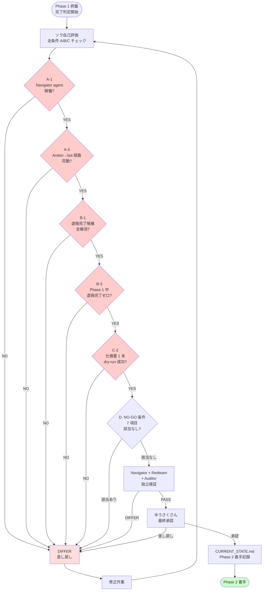
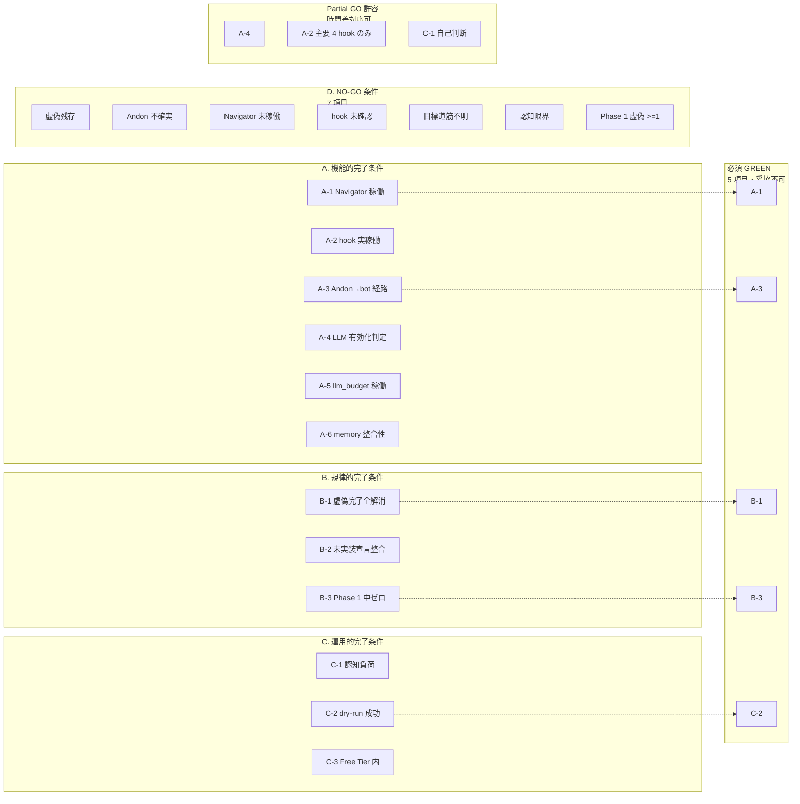

# Phase 1 完了判定フロー図

**作成**: 2026-04-22
**対象文書**: `data/governance/phase1_completion_criteria_20260422.md`

## 1. 判定プロセス フロー（時系列）



**赤枠の 5 項目 = 必須 GREEN**（どれか NO で即差し戻し）

---

## 2. 条件カテゴリ構造図



---

## 3. ASCII 簡略版（フロー図非対応環境用）

```
[Phase 1 終盤]
    ↓
[ソラ自己評価: A/B/C 全条件チェック]
    ↓
[必須 GREEN 5 項目]
  ├─ A-1 Navigator 稼働? ────── NO → [DIFFER 差し戻し]
  ├─ A-3 Andon→bot 経路完動? ── NO → [DIFFER 差し戻し]
  ├─ B-1 虚偽完了候補全解消? ── NO → [DIFFER 差し戻し]
  ├─ B-3 Phase 1 中虚偽ゼロ? ── NO → [DIFFER 差し戻し]
  └─ C-2 仕様書 1 本 dry-run? ─ NO → [DIFFER 差し戻し]
    ↓ 全 YES
[D. NO-GO 条件 7 項目: どれか該当?] ── YES → [DIFFER 差し戻し]
    ↓ NO（該当なし）
[Navigator + Redteam + Auditor 独立検証] ── DIFFER → [差し戻し]
    ↓ PASS
[ゆうさくさん 最終承認] ── 差し戻し → [修正]
    ↓ 承認
[CURRENT_STATE.md に Phase 2 着手記録]
    ↓
[Phase 2 着手 GO]
```

---

## 4. Partial GO の範囲

```
┌─────────────────────────────────────────┐
│       必須 GREEN（5 項目・妥協不可）      │
│  A-1 / A-3 / B-1 / B-3 / C-2              │
├─────────────────────────────────────────┤
│       Partial GO 許容（時間差対応可）     │
│  A-4 外部 LLM 有効化判定                  │
│  A-2 hook 実稼働（主要 4 つで OK）        │
│  C-1 認知負荷（本人自己判断）             │
├─────────────────────────────────────────┤
│       通常 GREEN（目指すが強制でない）    │
│  A-5 / A-6 / B-2 / C-3                    │
└─────────────────────────────────────────┘
```

---

## 関連ファイル
- `data/governance/phase1_completion_criteria_20260422.md`（本体・文章版）
- `memory/CURRENT_STATE.md`（Phase 0 完了状況記録）
- `memory/project_session_20260422_major_redesign.md`
